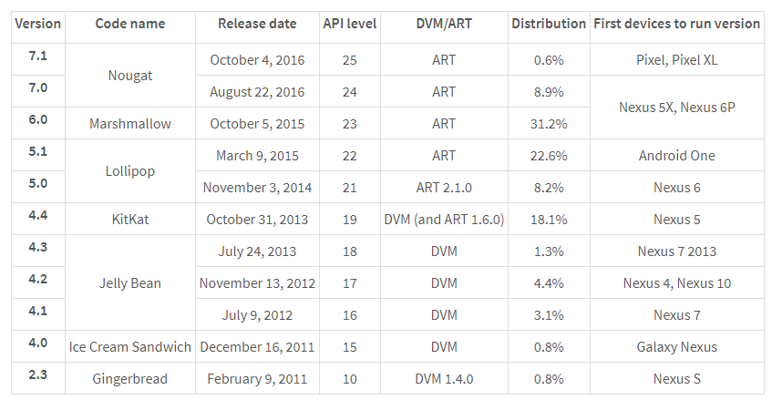
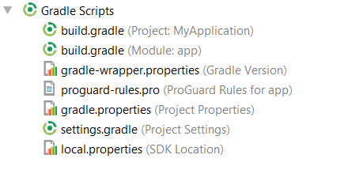

## Review Materi Pertemuan Pertama Doscom University

## Apa itu Android?
Android adalah sistem operasi yang dikeluarkan oleh Google khususnya untuk smartphone dan tablet. Berbagai macam produsen telah menggunakan Android sebagai sistem operasi untuk device yang mereka produksi. Android juga mempunyai store dimana terdapat 1 miliar pengguna aktif.

## Mengapa Android
### Sistem Operasi SmartphoneTerpopuler
Sejak direlease pada tahun 2008, Android mengeluarkan beberapa versi dan hingga saat ini yang terbaru adalah Nougat yang di release pada tahun 2016. Pada tahun 2013 Android menjadi best-selling OS pada tablet dan menjadi os yang majoritas digunakan oleh pengguna smartphone. Tercatat pada tahun 2016 store Android memiliki lebih dari 2.7 juta aplikasi dan lebih dari 2 miliar penggunaaktif tiap bulannya.
### Store
Aplikasi Android bisa di distribusikan dengan menggunakan web, copy apk, email dan store. Store Android yaitu Google Play merupakan cara termudah bagi para developer untuk medistribusikan aplikasinya ke pasar yang memiliki jutaan pengguna.

## Development Kit untuk developer
Android Software Development Kit (SDK) merupakan kit yang bisa digunakan oleh para developer untuk mengembangkan aplikasi berbasis Android. SDK di dalamnya terdapat beberapa tools untuk mengembangkan aplikasi seperti debugger, software libraries, emulator, dokumentasi, sample code dan tutorial.

Bahasa pemrograman yang sering digunakan untuk mengembangkan aplikasi Android adalah Java, namun ada beberapa Bahasa lainnya yang juga support untuk mengembangkan aplikasi Android seperti C++, dan Go. Dan pada Google IO 2017 menjadikan Kotlin sebagai Bahasa yang disupport resmi oleh Google.

### Sejarah Android
Dibawah ini berupa list sejarah dari Android yang resmi di release oleh Google.


### XML (Extensible Markup Language)
XML termasuk bahasa markup, yang diprakarsai oleh W3C, selaku Konsorsium World Wide Web, yang dimana XML, merupakan versi lanjutan dari HTML(Hypertext Markup Language).  
"Jika HTML ,hanya menampilkan  informasi ,XML memproses dan mengolah informasi."

Informasi ini bisa kita sebut sebagai element.  Setiap awalan element ,akan di awali dengan tag pembuka seperti <  dan harus di akhiri dengan tag penutup />.
Setiap element mempunyai detail-detail informasi, yang biasa di sebut atribut. Masing-masing atribut,
mempunyai nama dan value atau nilai.

#### Memahami struktur XML
XML sendiri memiliki struktur hirarkiah sebagai berikut :


TextView : Element
minimal atribut yang harus ada :
- android:layout_width (Fungsi : jenis atau ukuran lebar TextView) 
- android:layout_height ( Fungsi : jenis atau ukuran tinggi TextView)

Yang termasuk nilai atau value :

- wrap_content ( Fungsi : value jenis atau ukuran tinggi TextView)
- 30sp ( Fungsi : ukuran text)
- @string/selamat_ulang_tahun (Fungsi : string/isi teks)


#### Namespace XML

Namespace XML, digunakan untuk nama unik dari element dan atribut, didalam sebuah dokumen XML. Pada pengembangan Aplikasi Android ,setiap kita ingin menerapkan RelativeLayout atau LinearLayout sebagai RootView pada Layout , wajib mendefinisikan namespace XML ,yang dimana ,kita menggunakan xmlns:android  sebagai atribut, dan nilai atau value "http://schemas.android.com/apk/res/android".  Karna ini merupakan unique identifier, sama halnya pada penggunaan di bahasa pemrograman PHP ,atau C++. 

#### Antar Muka Layout
Semua element antarmuka pada Aplikasi Android, di bangun menggunakan View dan ViewGroup. View adalah suatu object ,yang di tampilkan di layar ,untuk menangani interaksi user (pengguna). Contohnya seperti TextView ,EditText,Button dan lain sebagainya. ViewGroup adalah objek yang menangani beberapa View dan View Group, yang dimana digunakan untuk mendefinisikan tata letak antar muka.Contohnya seperti : RelativeLayout, LinearLayout, dan lain-lain. Kita dapat membangun antar muka pada Layout XML ,dengan cara nested(bersarang).


### Layout
- LinearLayout
- RelativeLayout
- ConstraintLayout

#### LinearLayout
```xml
<LinearLayout xmlns:android="http://schemas.android.com/apk/res/android"
    xmlns:tools="http://schemas.android.com/tools"
    android:layout_width="match_parent"
    android:layout_height="match_parent"
    android:orientation="horizontal" >
```
LinearLayout identik dengan android:orientation yaitu VERTICAL & HORIZONTAL

#### RelativeLayout
```xml
<RelativeLayout 
    xmlns:android="http://schemas.android.com/apk/res/android"
    xmlns:tools="http://schemas.android.com/tools"
    android:layout_width="match_parent"
    android:layout_height="match_parent" >
```
RelativeLayout identik dengan pemberian value = {id} pada tiap element

### View


## First Project
### Android Manifest

Manifest adalah salah satu file yang harus ada di dalam sebuah project Android. Manifest berfungsi sebagai file yang memberikan informasi penting dari sebuah aplikasi ke sistem Android. Sistem perlu mengetahui apa yang akan digunakan oleh aplikasi sebelum bisa mulai dijalankan.

Beberapa fungsi yang ada di dalam manifest adalah sebagai berikut.
#### Nama Package
```
<manifest xmlns:android="http://schemas.android.com/apk/res/android"
    package="com.dicoding.myapplication">
```
Package name merupakan sebagai identitas unik dari sebuahaplikasi. Identitas ini juga yang akan digunakan di dalam store untuk membedakan suatu aplikasi dengan aplikasi lainnya. Jangan pernah mengganti value di dalam package karena nantinya akan dikenali sebagai aplikasi yang lainjika sudah masuk ke dalam store.

#### Komponen Aplikasi
Berfungsi untuk mendiskripsikan komponen dari aplikasi mulai dari activity, services, broadcast receiver, dan content provider.
```
<application
    android:allowBackup="true"
    android:icon="@mipmap/ic_launcher"
    android:label="@string/app_name"
    android:roundIcon="@mipmap/ic_launcher_round"
    android:supportsRtl="true"
    android:theme="@style/AppTheme">
    <activity android:name=".MainActivity">
        <intent-filter>
            <action android:name="android.intent.action.MAIN" />
 
            <category android:name="android.intent.category.LAUNCHER" />
        </intent-filter>
    </activity>
 
    <service
        android:name=".MyIntentService"
        android:exported="false" />
 
    <receiver
        android:name=".MyReceiver"
        android:enabled="true"
        android:exported="true"></receiver>
</application>
```
Komponen aplikasi semuanya berada di antara tag <application>. Disini juga berfungsi sebagai penamaan kelas yangmeng-implement komponen dan mendeskripsikan kemampuannya seperti intent-filter, dimana fungsinya mendeskripsikan bahwa komponen itu adalah yang pertama kali dijalankan. 

#### Permission
Mendeklarasikan permission apa saja yang harus dimiliki oleh aplikasi untuk akses ke dalam komponen API seperti internet, external storage, contact, dan juga untuk berinteraksi kepada aplikasi lainnya.


### Gradle
Gradle merupakan open source build automation system. Automation system berguna untuk mengotomatisasi proses pembuatan dari software build dan proses-proses terkait lainnya termasuk compile source code menjadi binary code, packaging binary code, dan menjalankan automated test.


#### build.gradle (Project: MyApplication)

Merupakan software build tingkat teratas yang meliputi keseluruhan dari project dari sebuah aplikasi. Di dalamnya berisi konfigurasi semua modul yang ada di dalam project.

#### build.gradle (Module: app)

Merupakan software build yang ada pada setiap modul di dalam project sebuah aplikasi. Beberapa konfigurasi yang di edit di antaranya adalah android settings, defaultConfig dan productFlavors, buildTypes, dan dependencies.
```
apply plugin: 'com.android.application'
android {
    compileSdkVersion 25
    buildToolsVersion "25.0.2"
    defaultConfig {
        applicationId "com.dicoding.myapplication"
        minSdkVersion 21
        targetSdkVersion 25
        versionCode 1
        versionName "1.0"
        testInstrumentationRunner "android.support.test.runner.AndroidJUnitRunner"
    }
    buildTypes {
        release {
            minifyEnabled false
            proguardFiles getDefaultProguardFile('proguard-android.txt'), 'proguard-rules.pro'
        }
    }
}
 
dependencies {
    compile fileTree(dir: 'libs', include: ['*.jar'])
    androidTestCompile('com.android.support.test.espresso:espresso-core:2.2.2', {
        exclude group: 'com.android.support', module: 'support-annotations'
    })
    compile 'com.android.support:appcompat-v7:25.3.1'
    compile 'com.android.support.constraint:constraint-layout:1.0.2'
    testCompile 'junit:junit:4.12'
}
```
#### Android Settings
Di dalam block android kita bisa menetapkan compileSDKVersion dan buildToolsVersion.
#### Default Config
Di dalamnya terdapat properties seperti applicationID, minSdkVersion, targetSdkVersion dan test information.
#### Build Types
Di dalamnya terdapat properties dari debuggable, ProGuard enabling, debug signing, version name suffix dan test information.
#### Dependencies
Di dalamnya terdapat `informasi tentang library yang digunakan oleh aplikasi.

### Sync Project

Setiap kali terjadi perubahan informasi di dalam build.gradle maka kita harus melakukan sinkronisasi terlebih dahulu. Tombol sync now akan muncul pada sebelah kanan atas ketika terjadi perubahan.
Setelah proses sinkronisasi selesai maka akan muncul informasi pada log apakah proses sinkronisasi berhasil atau tidak.


---

## Referensi dan Tambahan
- :bulb: [Basic git dan github oleh hacktiv8](https://github.com/hacktiv8/phase-0-activities/blob/master/modules/git-github-basics.md)
- :bulb: [Tutorial interaktif Git dan Github oleh codesaya.com](https://codesaya.com/git/)

---


---
credits:
- [Sololearn](https://www.sololearn.com/)
- [w3schools](https://www.w3schools.com/)
- [doscom](http://doscom.org/)
