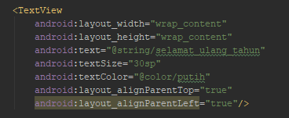

## Review Materi Pertemuan Pertama Doscom University

### XML (Extensible Markup Language)
XML termasuk bahasa markup, yang diprakarsai oleh W3C, selaku Konsorsium World Wide Web, yang dimana XML, merupakan versi lanjutan dari HTML(Hypertext Markup Language).  
"Jika HTML ,hanya menampilkan  informasi ,XML memproses dan mengolah informasi."

Informasi ini bisa kita sebut sebagai element.  Setiap awalan element ,akan di awali dengan tag pembuka seperti <  dan harus di akhiri dengan tag penutup />.
Setiap element mempunyai detail-detail informasi, yang biasa di sebut atribut. Masing-masing atribut,
mempunyai nama dan value atau nilai.

#### Memahami struktur XML
XML sendiri memiliki struktur hirarkiah sebagai berikut :




TextView : Element
minimal atribut yang harus ada :
- android:layout_width (Fungsi : jenis atau ukuran lebar TextView) 
- android:layout_height ( Fungsi : jenis atau ukuran tinggi TextView)

Yang termasuk nilai atau value :

- wrap_content ( Fungsi : value jenis atau ukuran tinggi TextView)
- 30sp ( Fungsi : ukuran text)
- @string/selamat_ulang_tahun (Fungsi : string/isi teks)


#### Namespace XML

Namespace XML, digunakan untuk nama unik dari element dan atribut, didalam sebuah dokumen XML. Pada pengembangan Aplikasi Android ,setiap kita ingin menerapkan RelativeLayout atau LinearLayout sebagai RootView pada Layout , wajib mendefinisikan namespace XML ,yang dimana ,kita menggunakan xmlns:android  sebagai atribut, dan nilai atau value "http://schemas.android.com/apk/res/android".  Karna ini merupakan unique identifier, sama halnya pada penggunaan di bahasa pemrograman PHP ,atau C++. 

#### Antar Muka Layout
Semua element antarmuka pada Aplikasi Android, di bangun menggunakan View dan ViewGroup. View adalah suatu object ,yang di tampilkan di layar ,untuk menangani interaksi user (pengguna). Contohnya seperti TextView ,EditText,Button dan lain sebagainya. ViewGroup adalah objek yang menangani beberapa View dan View Group, yang dimana digunakan untuk mendefinisikan tata letak antar muka.Contohnya seperti : RelativeLayout, LinearLayout, dan lain-lain. Kita dapat membangun antar muka pada Layout XML ,dengan cara nested(bersarang).


### Layout
- LinearLayout
- RelativeLayout
- ConstraintLayout

#### LinearLayout
```xml
<LinearLayout xmlns:android="http://schemas.android.com/apk/res/android"
    xmlns:tools="http://schemas.android.com/tools"
    android:layout_width="match_parent"
    android:layout_height="match_parent"
    android:orientation="horizontal" >
```
LinearLayout identik dengan android:orientation yaitu VERTICAL & HORIZONTAL

#### RelativeLayout
```xml
<RelativeLayout 
    xmlns:android="http://schemas.android.com/apk/res/android"
    xmlns:tools="http://schemas.android.com/tools"
    android:layout_width="match_parent"
    android:layout_height="match_parent" >
```
RelativeLayout identik dengan pemberian value = {id} pada tiap element

### View


---

## Referensi dan Tambahan
- :bulb: [Basic git dan github oleh hacktiv8](https://github.com/hacktiv8/phase-0-activities/blob/master/modules/git-github-basics.md)
- :bulb: [Tutorial interaktif Git dan Github oleh codesaya.com](https://codesaya.com/git/)

---


---
credits:
- [Sololearn](https://www.sololearn.com/)
- [w3schools](https://www.w3schools.com/)
- [doscom](http://doscom.org/)
