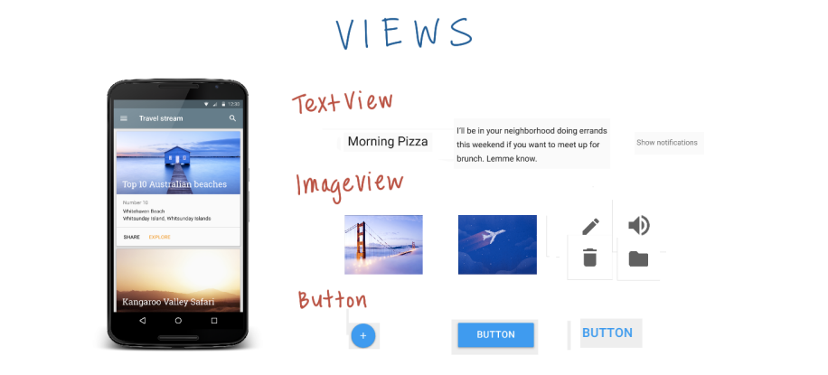
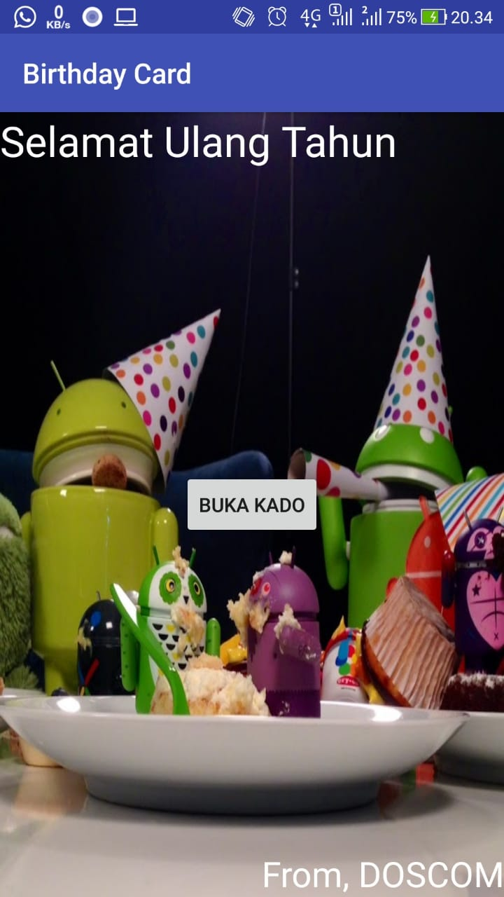
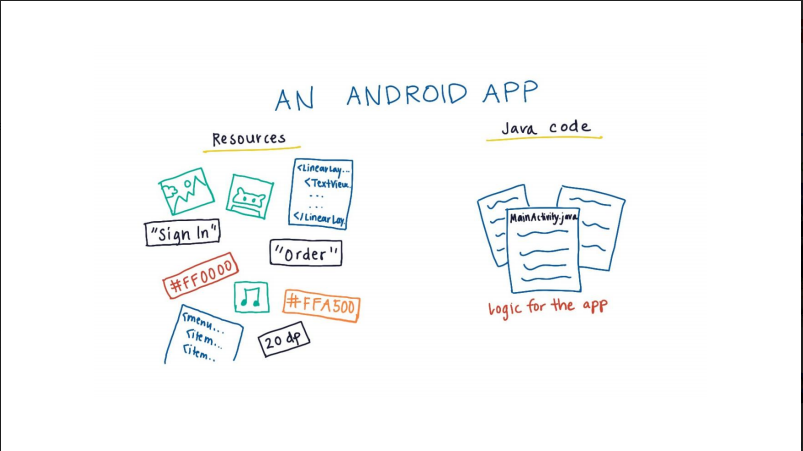

#Pertemuan Pertama Mobile-Android Doscom University 2019

Selamat anda mengambil Mobile-Android Doscom University 2019, pada akhir DU ini, anda akan paham bagaimana cara membuat single-screen Android app with tulisan and gambar.



Dalam pelatihan ini, kita akan belajar step-by-step bagaimana untuk membuat sebuah aplikasi, seperti kartu ucapan selamat ulang tahun ini, dan bagaimana untuk menjalankannya pada sebuah android device.



Kemudian anda bisa untuk kostumisasi kartu ucapan untuk seseorang yang spesial pada masa mendatang. 
Pada pelatihan ini, anda akan belajar bagaimana menggunakan Android Studio, alat yang digunakan developers untuk membuat aplikasi.

##Inti dari Aplikasi Android



##Views


Pada android studio kita akan menggunakan style penulisan CamelCase, berbeda dengan html atau css yang menggunakan snake_case.
Contoh dari CamelCase
FedEx, iPod, PowerPoint, McDonalds

Pada Materi View, kita akan belajar
1. Layout
2. TextView
3. ImageView
4. Button

###1. Layout
Layout pada android terdapat 3
1. ConstraintLayout
2. RelativeLayout
3. LinearLayout

#### LinearLayout
```xml
<LinearLayout xmlns:android="http://schemas.android.com/apk/res/android"
    xmlns:tools="http://schemas.android.com/tools"
    android:layout_width="match_parent"
    android:layout_height="match_parent"
    android:orientation="horizontal" >
```
LinearLayout identik dengan android:orientation yaitu VERTICAL & HORIZONTAL

#### RelativeLayout
```xml
<RelativeLayout 
    xmlns:android="http://schemas.android.com/apk/res/android"
    xmlns:tools="http://schemas.android.com/tools"
    android:layout_width="match_parent"
    android:layout_height="match_parent" >
```
RelativeLayout identik dengan pemberian value = {id} pada tiap element

###2. TextView
  
```xml
 <TextView
        android:layout_width="wrap_content"
        android:layout_height="wrap_content"
        android:text="@string/selamat_ulang_tahun"
        android:textSize="30sp"
        android:textColor="@color/putih"
        android:layout_alignParentTop="true"
        android:layout_alignParentLeft="true"/>
```

###3. ImageView
```xml
<ImageView
        android:layout_width="match_parent"
        android:layout_height="match_parent"
        android:src="@drawable/androidparty"
        android:scaleType="fitXY" />
```

###4. Button
```xml
<Button
        android:layout_width="wrap_content"
        android:layout_height="wrap_content"
        android:text="Buka Kado"
        android:layout_centerInParent="true"
        android:onClick="kado"/>
```

Pada android studio user interface menggunakan bahasa XML, ukuran yang ditetapkan adalah:
1. Gambar = dp
2. Text = sp
3. layout = wrap_content / match_parent

---

## Referensi dan Tambahan
- :bulb: [Basic git dan github oleh hacktiv8](https://github.com/hacktiv8/phase-0-activities/blob/master/modules/git-github-basics.md)
- :bulb: [Tutorial interaktif Git dan Github oleh codesaya.com](https://codesaya.com/git/)
- :bulb: [UserInterface dan UserInput](https://www.udacity.com/)


---


---
credits:
- [Sololearn](https://www.sololearn.com/)
- [w3schools](https://www.w3schools.com/)
- [doscom](http://doscom.org/)
