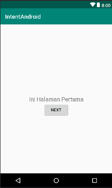
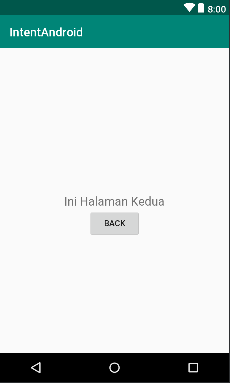

## Intent
### Apa itu Intent?
Intent digunakan untuk berpindah ke activity lain pada android studio. Intent ini akan sering sekali dipakai nantinya didalam android studio.

Biar kebayang kita akan buat aplikasinya seperti dibawah ini, yang nantinya ada sebuat tombol yang ketika diklik maka akan berpindah ke Activity/halaman lainnya.




### XML - 1
```xml
<?xml version="1.0" encoding="utf-8"?>
<RelativeLayout xmlns:android="http://schemas.android.com/apk/res/android"
    xmlns:app="http://schemas.android.com/apk/res-auto"
    xmlns:tools="http://schemas.android.com/tools"
    android:layout_width="match_parent"
    android:layout_height="match_parent"
    tools:context=".MainActivity">

    <TextView
        android:id="@+id/teks"
        android:layout_width="wrap_content"
        android:layout_height="wrap_content"
        android:layout_centerInParent="true"
        android:text="Ini Halaman Pertama"
        android:textSize="20sp" />

    <Button
        android:layout_width="wrap_content"
        android:layout_height="wrap_content"
        android:layout_below="@+id/teks"
        android:layout_centerHorizontal="true"
        android:onClick="next"
        android:text="Next" />

</RelativeLayout>
```

### XML - 2
```xml
<?xml version="1.0" encoding="utf-8"?>
<RelativeLayout xmlns:android="http://schemas.android.com/apk/res/android"
    xmlns:app="http://schemas.android.com/apk/res-auto"
    xmlns:tools="http://schemas.android.com/tools"
    android:layout_width="match_parent"
    android:layout_height="match_parent"
    tools:context=".Main2Activity">

    <TextView
        android:id="@+id/teks"
        android:layout_width="wrap_content"
        android:layout_height="wrap_content"
        android:layout_centerInParent="true"
        android:text="Ini Halaman Kedua"
        android:textSize="20sp" />

    <Button
        android:layout_width="wrap_content"
        android:layout_height="wrap_content"
        android:layout_below="@+id/teks"
        android:layout_centerHorizontal="true"
        android:onClick="back"
        android:text="Back" />

</RelativeLayout>
```
## Intent
Intent bisa menggunkan 
1. [namaclass].this, [classTujuan].class
2. getApplicationContext(), [classTujuan].class

### Intent - 1
```xml
public void next(View view) {
        Intent i = new Intent(MainActivity.this,Main2Activity.class);
        startActivity(i);
    }
```

### Intent - 2
```xml
public void back(View view) {
        Intent i = new Intent(getApplicationContext(),MainActivity.class);
        startActivity(i);
    }
```

## GOJEK-CLONE
### Disini kita akan belajar cloning UI aplikasi GO-JEK 
