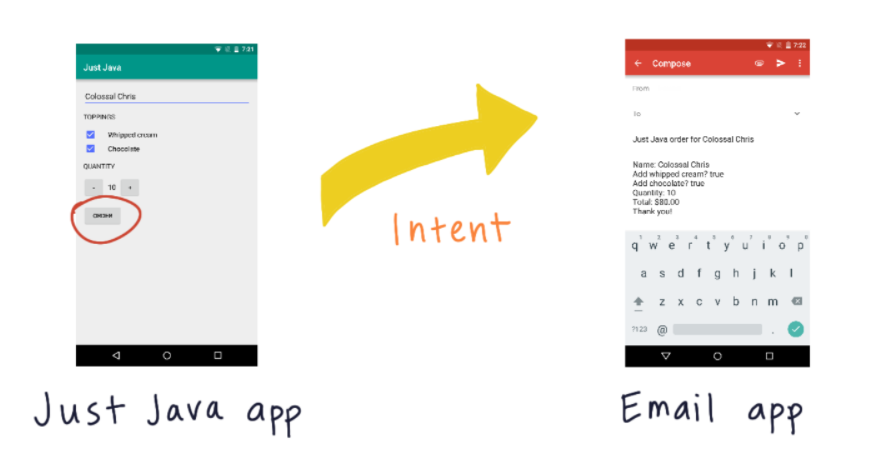
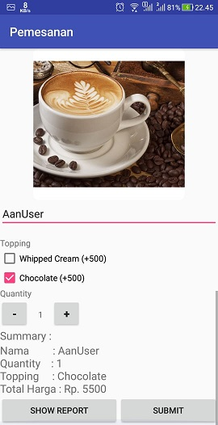
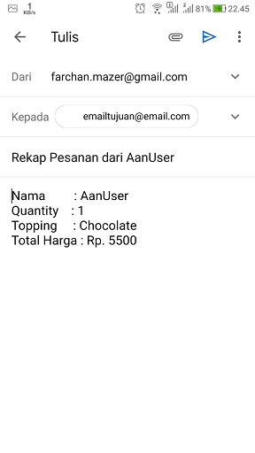
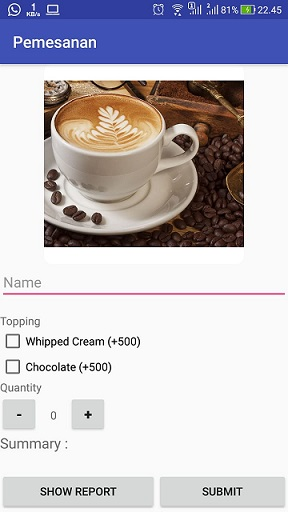

## USER INPUT

Tujuan dari course user input, diharap anda dapat membuat aplikasi android dengan tombol dan text fields dan user dapat berinteraksi didalamnya.
Kita akan membuat aplikasi Pemesanan app, dimana user dapat memesan kopi.



## Goals !




### User Interface

### XML
```xml
<?xml version="1.0" encoding="utf-8"?>
<ScrollView xmlns:android="http://schemas.android.com/apk/res/android"
    android:layout_width="match_parent"
    android:layout_height="match_parent"
    xmlns:tools="http://schemas.android.com/tools"
    tools:context=".MainActivity">

    <LinearLayout
        android:layout_width="match_parent"
        android:layout_height="match_parent"
        android:orientation="vertical"
        xmlns:app="http://schemas.android.com/apk/res-auto"
        xmlns:tools="http://schemas.android.com/tools">

        <ImageView
            android:layout_width="250dp"
            android:layout_height="250dp"
            android:layout_gravity="center"
            android:background="@drawable/corner"
            android:src="@drawable/kopi"/>

        <LinearLayout
            android:layout_width="match_parent"
            android:layout_height="wrap_content"
            android:orientation="vertical">

            <EditText
                android:id="@+id/edtName"
                android:layout_width="match_parent"
                android:layout_height="wrap_content"
                android:layout_marginBottom="16dp"
                android:hint="Name"
                android:inputType="textPersonName" />

            <TextView
                android:layout_width="match_parent"
                android:layout_height="wrap_content"
                android:text="Topping" />

            <CheckBox
                android:id="@+id/cbWCream"
                android:layout_width="match_parent"
                android:layout_height="wrap_content"
                android:text="Whipped Cream (+500)" />

            <CheckBox
                android:id="@+id/cbChoco"
                android:layout_width="match_parent"
                android:layout_height="wrap_content"
                android:text="Chocolate (+500)" />

            <TextView
                android:layout_width="match_parent"
                android:layout_height="wrap_content"
                android:text="Quantity" />

            <LinearLayout
                android:layout_width="match_parent"
                android:layout_height="wrap_content"
                android:orientation="horizontal">

                <Button
                    android:layout_width="48dp"
                    android:layout_height="48dp"
                    android:onClick="decrement"
                    android:text="-"
                    android:textSize="18sp"
                    android:textStyle="bold" />

                <TextView
                    android:id="@+id/tvQuantity"
                    android:layout_width="38dp"
                    android:layout_height="wrap_content"
                    android:text="0"
                    android:textAlignment="center"
                    android:textSize="14sp" />

                <Button
                    android:layout_width="48dp"
                    android:layout_height="48dp"
                    android:onClick="increment"
                    android:text="+"
                    android:textSize="18sp"
                    android:textStyle="bold" />
            </LinearLayout>

            <TextView
                android:layout_width="match_parent"
                android:layout_height="wrap_content"
                android:text="Summary : "
                android:textSize="18sp" />

            <TextView
                android:id="@+id/tvSummary"
                android:layout_width="match_parent"
                android:layout_height="wrap_content"
                android:textSize="18sp" />

            <LinearLayout
                android:layout_width="match_parent"
                android:layout_height="wrap_content"
                android:orientation="horizontal">

                <Button
                    android:layout_width="wrap_content"
                    android:layout_height="wrap_content"
                    android:layout_weight="1"
                    android:onClick="btnReport"
                    android:text="Show Report" />

                <Button
                    android:layout_width="wrap_content"
                    android:layout_height="wrap_content"
                    android:layout_weight="1"
                    android:onClick="submitOrder"
                    android:text="Submit" />
            </LinearLayout>
        </LinearLayout>
    </LinearLayout>
</ScrollView>


```

### MainActivity.Java
```
    int quantity=0;
    int price=0;
    TextView tvSummary;
    public final static String STATE_HASIL="";

    @Override
    protected void onCreate(Bundle savedInstanceState) {
        super.onCreate(savedInstanceState);
        setContentView(R.layout.activity_main);
        tvSummary = findViewById(R.id.tvSummary);
        //Mengecek apakah ada data tersimpan distate hasil > OnSaveInstance
        if(savedInstanceState != null){
            String hasil = savedInstanceState.getString(STATE_HASIL);
            tvSummary.setText(hasil);
        }
    }
    
    //SaveInstanceState digunakan agar nilai tetap tersimpan jika HP Dirotate
    @Override
    public void onSaveInstanceState(Bundle outState){
        outState.putString(STATE_HASIL, tvSummary.getText().toString());
        super.onSaveInstanceState(outState);
    }
    
    public void decrement(View view) {
        //quantity = quantity - 1;
        if(quantity == 0){
            display(quantity);
        }else{
            quantity -= 1;
            display(quantity);
        }
    }
    
    public void increment(View view) {
        //quantity = quantity + 1;
        quantity += 1;
        display(quantity);
    }

    //Display = Nama Metode/Fungsi private void display
    //private void display(int quantity) int quantity =
    private void display(int quantity) {
        TextView tvQuantity = findViewById(R.id.tvQuantity); //R = Reference
        tvQuantity.setText("" + quantity);
    }
    
    
    public void btnReport(View view) {
        //Layout binding  => menghubungkan layout & java
        EditText edtName = findViewById(R.id.edtName);
        //Mengambil nilai dari edit text dengan GetText
        String name = edtName.getText().toString();

        //Bagian CheckBox
        String topping = "";
        CheckBox WhippedCreamCB = findViewById(R.id.cbWCream);
        boolean hasWhippedCream = WhippedCreamCB.isChecked();

        CheckBox Choco = findViewById(R.id.cbChoco);
        boolean hasChoco = Choco.isChecked();

        //KONDISI
        if(hasWhippedCream == true && hasChoco == true){
            topping = "Whipped Cream & Chocolate";
        }
        else if(hasChoco == true){
            topping = "Chocolate";
        }
        else if(hasWhippedCream == true){
            topping = "Whipped Cream";
        }
        else{
            topping = "Tanpa Topping";
        }
        price = CalculatePrice(hasWhippedCream,hasChoco);
        String orderSummary = CreateOrderSummary(price, name, topping);
        DisplaySummary(price, orderSummary);
    }

    public void submitOrder(View view) {
        //Layout binding  => menghubungkan layout & java
        EditText edtName = findViewById(R.id.edtName);
        //Mengambil nilai dari edit text dengan GetText
        String name = edtName.getText().toString();

        //Bagian CheckBox
        String topping = "";
        CheckBox WhippedCreamCB = findViewById(R.id.cbWCream);
        boolean hasWhippedCream = WhippedCreamCB.isChecked();

        CheckBox Choco = findViewById(R.id.cbChoco);
        boolean hasChoco = Choco.isChecked();

        //KONDISI
        if(hasWhippedCream == true && hasChoco == true){
            topping = "Whipped Cream & Chocolate";
        }
        else if(hasChoco == true){
            topping = "Chocolate";
        }
        else if(hasWhippedCream == true){
            topping = "Whipped Cream";
        }
        else{
            topping = "Tanpa Topping";
        }
        price = CalculatePrice(hasWhippedCream,hasChoco);
        String orderSummary = CreateOrderSummary(price, name, topping);
        //DisplaySummary(price, orderSummary);

        Intent implicitIntent = new Intent(Intent.ACTION_SENDTO);
        // Membuka aplikasi lain yang dapat digunakan untuk mengirim email
        // ke emailtujuan@email.com
        implicitIntent.setData(Uri.parse("mailto: emailtujuan@email.com"));
        //subject Email
        implicitIntent.putExtra(Intent.EXTRA_SUBJECT, "Rekap Pesanan dari "+name);//Subject pada emalil
        //ISI dari email menggunakan data dari variabel orderSummary
        implicitIntent.putExtra(Intent.EXTRA_TEXT, orderSummary);//Text pada email
        if(implicitIntent.resolveActivity(getPackageManager())!=null){
            startActivity(implicitIntent);
        }

    }//End of SubmitOrder Function
    
    
    public int CalculatePrice(boolean hasWhippedCream, boolean hasChoco){
        int hargaAwal = 5000;
        if(hasWhippedCream){
            hargaAwal = hargaAwal + 500;
        }

        if(hasChoco){
            hargaAwal = hargaAwal + 500;
        }
        return quantity * hargaAwal;
    }
    
    
    //Menampilkan Rekap Pesanan
    public void DisplaySummary(int price, String Summary){
        TextView tvSummary = findViewById(R.id.tvSummary);
        tvSummary.setText(Summary);

    }

    private String CreateOrderSummary(int price, String name, String topping){
        String priceMessage =
                 "Nama         : "+name
                +"\nQuantity    : "+quantity
                +"\nTopping     : "+topping
                +"\nTotal Harga : Rp. "+price;
        return priceMessage;
    }

    ```
